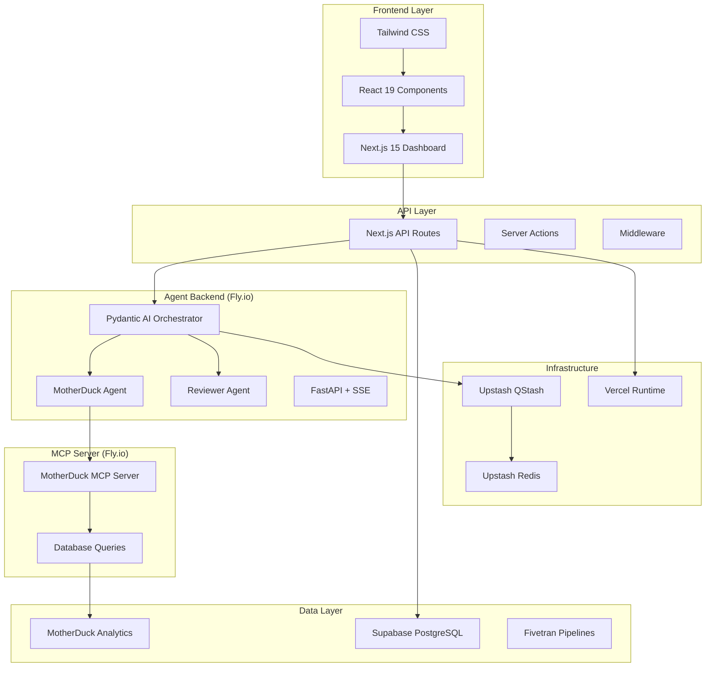

# Hubble


> An AI-powered Marketing Assistant with a full-stack Next.js 15 application, featuring real-time chat capabilities and automated data pipeline provisioning for multi-tenant analytics.

## 🚀 Quick Start

```bash
# Clone the repository
git clone https://github.com/omzification/hubble.git
cd hubble

# Install dependencies
pnpm install

# Set up environment variables
cp .env.example .env.local

# Start development server
pnpm dev
```

Visit [http://localhost:3000](http://localhost:3000) to see the application.

## 📋 Table of Contents

- [Overview](#-overview)
- [Architecture](#-architecture)
- [Features](#-features)
- [Tech Stack](#-tech-stack)
- [Project Structure](#-project-structure)
- [Getting Started](#-getting-started)
- [Environment Setup](#-environment-setup)
- [API Documentation](#-api-documentation)
- [Development](#-development)
- [Deployment](#-deployment)
- [Contributing](#-contributing)
- [License](#-license)

## 🎯 Overview

Hubble is a comprehensive AI-powered marketing assistant platform that provides:

- **Intelligent Chat Interface**: Real-time AI conversations with context-aware responses
- **Multi-tenant Data Pipeline**: Automated provisioning of MotherDuck databases and Fivetran destinations
- **Organization Management**: Clerk-based authentication with JWT-based organization context
- **Real-time Analytics**: Live data streaming and visualization capabilities
- **Scalable Architecture**: Built on modern serverless technologies

## 🏗 Architecture

Hubble uses a modern agentic architecture powered by Pydantic AI:



### Key Components

- **Dashboard**: Next.js on Vercel for UI and persistence
- **Agent Backend**: Pydantic AI agents on Fly.io for intelligent chat
- **MCP Server**: MotherDuck MCP server on Fly.io for data access
- **Security**: Service-to-service authentication with HMAC tokens

## ✨ Features

### 💬 AI Chat System

- **Multi-conversation Support**: Create and manage multiple chat sessions
- **Real-time Updates**: Live message streaming with optimistic UI
- **Message History**: Persistent conversation storage with RLS security
- **Idempotent Operations**: Duplicate message prevention
- **Archive Support**: Organize and manage conversation history
- **Shared Agent Runtime**: MCP-aware orchestration layer that manages tool handshakes, resumable sessions, and structured telemetry across chat surfaces

### 🤖 Pydantic AI Agents

- **Orchestrator Agent**: Routes queries to appropriate specialist agents using ReAct pattern
- **MotherDuck Agent**: Executes SQL queries and formats results for business users
- **Reviewer Agent**: Validates answers and suggests follow-up questions
- **Real-time Streaming**: Server-Sent Events (SSE) for live agent step visualization
- **Enhanced UI**: Agent step rendering with reasoning transparency

### 🔌 Connect Data Pipeline

- **Automated Provisioning**: One-click setup of data infrastructure
- **MotherDuck Integration**: Per-tenant database creation and management
- **Fivetran Connectors**: Automated data pipeline configuration
- **Real-time Status**: Live provisioning progress with SSE streams
- **Distributed Locking**: Prevents duplicate provisioning operations

### 🏢 Organization Management

- **Clerk Authentication**: Secure user and organization management
- **JWT-based Context**: Organization-scoped operations
- **Role-based Access**: Granular permission system
- **Multi-tenant Architecture**: Isolated data per organization

### 📊 Analytics & Monitoring

- **Real-time Dashboards**: Live data visualization
- **Performance Metrics**: Application and infrastructure monitoring
- **Error Tracking**: Comprehensive error logging and alerting
- **Audit Trails**: Complete operation history

## 🛠 Tech Stack

### Frontend

- **Framework**: Next.js 15 with App Router
- **UI Library**: React 19
- **Styling**: Tailwind CSS v4
- **Components**: Radix UI primitives with shadcn/ui patterns
- **State Management**: TanStack Query (React Query)
- **Authentication**: Clerk with JWT tokens

### Backend

- **Database**: Supabase (PostgreSQL with RLS)
- **Queue System**: Upstash QStash
- **Cache & Locks**: Upstash Redis
- **Data Platform**: MotherDuck (DuckDB) + Fivetran
- **Runtime**: Vercel (Node.js 20.x) + Fly.io (Python 3.11)
- **AI**: Anthropic Claude with Pydantic AI agents

### Development

- **Monorepo**: Turborepo + pnpm workspaces
- **Language**: TypeScript 5.x (strict mode)
- **Linting**: ESLint with shared configurations
- **Formatting**: Prettier with Tailwind plugin
- **Testing**: Vitest + Testing Library
- **Commits**: Commitizen with gitmoji

## 📁 Project Structure

```text
hubble/
├── apps/
│   └── dashboard/              # Next.js 15 web application
│       ├── src/
│       │   ├── app/           # App Router pages and API routes
│       │   ├── middleware.ts  # Next.js middleware
│       │   └── providers/     # React context providers
│       └── package.json
│
├── services/                   # Backend services
│   ├── agents/                # Pydantic AI agents (Fly.io)
│   └── mcp/                   # Multi-MCP gateway (Fly.io)
│       ├── motherduck/        # MotherDuck MCP server
│       ├── dice-roll/         # Dice Roll MCP server
│       ├── Dockerfile         # Multi-stage container
│       └── Caddyfile          # Reverse proxy config
│
├── packages/                   # Shared TypeScript packages
│   ├── auth/                  # Authentication & organization utilities
│   ├── chat/                  # Chat logic & database operations
│   ├── config/                # Environment configuration
│   ├── connect/               # Connect provisioning system
│   ├── core/                  # Core utilities & error handling
│   ├── db/                    # Supabase client factories
│   ├── infrastructure/        # QStash & Redis services
│   ├── logger/                # Structured logging system
│   ├── schemas/               # Zod schemas & validation
│   ├── server/                # Server-only utilities
│   ├── types/                 # Shared TypeScript types
│   ├── ui/                    # React components & Tailwind preset
│   ├── eslint-config/         # Shared ESLint configuration
│   ├── prettier-config/       # Shared Prettier configuration
│   └── tsconfig/              # Shared TypeScript configuration
│
├── supabase/                  # Database migrations and schema
│   ├── migrations/            # Database migration files
│   ├── archive/               # Historical migration files
│   └── cleanup.sql            # Database cleanup scripts
│
├── docs/                      # Comprehensive documentation
│   ├── apps/                  # Application-specific docs
│   ├── packages/              # Package documentation
│   ├── mcp/                   # MCP server documentation
│   └── supabase/              # Database documentation
│
├── .github/workflows/         # CI/CD pipelines
├── package.json               # Root package configuration
├── pnpm-workspace.yaml        # pnpm workspace configuration
├── turbo.json                 # Turborepo configuration
└── tsconfig.json              # Root TypeScript configuration
```

## 🚀 Getting Started

### Prerequisites

- **Node.js**: 20.10+ (< 25)
- **pnpm**: 9.x+
- **uv**: Latest (for Python services)
- **Supabase**: Project with secure secrets table
- **Clerk**: Application with publishable/secret keys
- **Upstash**: QStash + Redis accounts
- **MotherDuck + Fivetran**: Credentials (for Connect feature)

### Install UV

```bash
# macOS/Linux
curl -LsSf https://astral.sh/uv/install.sh | sh

# Windows
powershell -c "irm https://astral.sh/uv/install.ps1 | iex"
```

### Installation

1. **Clone the repository**

```bash
git clone https://github.com/omzification/hubble.git
cd hubble
```

2. **Install dependencies**

```bash
pnpm install
```

3. **Set up environment variables**

```bash
cp .env.example .env.local
# Edit .env.local with your credentials
```

4. **Start development server**

```bash
pnpm dev
```

5. **Open the application**
   Navigate to [http://localhost:3000](http://localhost:3000)

## 🔐 Environment Setup

### Required Environment Variables

Create a `.env.local` file in the root directory with the following variables:

```env
# Supabase Configuration
SUPABASE_URL=https://your-project.supabase.co
SUPABASE_ANON_KEY=your-anon-key
SUPABASE_SERVICE_ROLE_KEY=your-service-role-key

# Clerk Authentication
NEXT_PUBLIC_CLERK_PUBLISHABLE_KEY=pk_test_...
CLERK_SECRET_KEY=sk_test_...

# Upstash QStash (Queue System)
QSTASH_URL=https://qstash.upstash.io
QSTASH_TOKEN=your-token
QSTASH_CURRENT_SIGNING_KEY=your-key
QSTASH_NEXT_SIGNING_KEY=your-next-key

# Upstash Redis (Cache & Locks)
UPSTASH_REDIS_REST_URL=https://...upstash.io
UPSTASH_REDIS_REST_TOKEN=your-token
UPSTASH_REDIS_WS_URL=wss://...upstash.io
UPSTASH_REDIS_WS_TOKEN=your-token

# Data Platform (Optional - for Connect feature)
MD_ADMIN_TOKEN=your-motherduck-token
FIVETRAN_API_KEY=your-fivetran-key
FIVETRAN_API_SECRET=your-fivetran-secret

# AI Service (Optional)
ANTHROPIC_API_KEY=your-anthropic-key
```

### Database Setup

1. **Create Supabase project** at [supabase.com](https://supabase.com)
2. **Run migrations**:

```bash
# Apply all migrations
supabase db push
```

3. **Set up RLS policies** for multi-tenant security
4. **Configure secrets table** for secure credential storage

## 📚 API Documentation

### Health & Status

- `GET /healthz` - Health check endpoint
- `GET /version` - Application version information

### Chat API

- `GET /api/v1/chat/conversations` - List user conversations
- `POST /api/v1/chat/conversations` - Create new conversation
- `PATCH /api/v1/chat/conversations/:id` - Update conversation
- `GET /api/v1/chat/messages/:conversationId` - List conversation messages
- `POST /api/v1/chat/messages/:conversationId` - Create new message
- `POST /api/v1/chat` - Send AI chat request

### Connect API

- `POST /api/connect/enable` - Start data pipeline provisioning
- `GET /api/connect/status` - Check provisioning status
- `GET /api/connect/stream` - Real-time provisioning updates (SSE)
- `GET /api/connect/overview` - Connection overview
- `GET /api/connect/connector-types` - Available connector types

For detailed API documentation, see `docs/apps/dashboard/api.md` (dashboard endpoints) and `docs/packages/server.md` (server utilities and agent interfaces).

## 💻 Development

### Local Development

```bash
# Install dependencies (JS + Python)
pnpm install
turbo sync  # Syncs Python deps via uv

# Start all services
pnpm dev

# Or start specific services
pnpm dev:mcp      # All MCP servers
pnpm dev:agents   # Agent backend
```

### Available Scripts

```bash
# Development
pnpm dev                    # Start all applications
pnpm build                  # Build all packages
pnpm typecheck             # TypeScript type checking
pnpm lint                  # ESLint linting
pnpm test                  # Run test suite
pnpm format                # Format code with Prettier

# Package-specific commands
pnpm --filter @hubble/dashboard dev
pnpm --filter @hubble/ui build
pnpm --filter @hubble/auth typecheck

# Agent Development
pnpm dev:agents           # Start agent backend
pnpm cli:agents           # Interactive CLI with Anthropic Extended Thinking
pnpm dev:mcp              # Start all MCP servers
pnpm dev                  # Start all services

# MCP Inspector
pnpm inspector:motherduck  # Test MotherDuck MCP
pnpm inspector:dice        # Test Dice Roll MCP

# Testing & Quality
pnpm test:agents          # Test agent backend
pnpm lint:agents          # Lint agent backend
pnpm typecheck:agents     # Type-check agent backend

# Deployment
# Deployment happens automatically via GitHub Actions
# Monitor at: https://github.com/omzification/hubble/actions
```

### Benefits

- **Fast Python installs**: `uv` is 10-100x faster than pip
- **No venv needed**: `uv run` handles isolation automatically
- **Unified tasks**: `turbo` orchestrates all TypeScript and Python tasks
- **Parallel execution**: Tasks run in parallel when possible
- **Smart caching**: Turbo caches task results across the monorepo

### Code Quality

The project enforces high code quality standards:

- **TypeScript**: Strict mode with comprehensive type checking
- **ESLint**: Shared configuration across all packages
- **Prettier**: Consistent code formatting
- **Husky**: Pre-commit hooks for quality checks
- **Commitizen**: Standardized commit messages

### Commit Convention

We use [gitmoji](https://gitmoji.dev/) for commit messages:

```bash
pnpm commit  # Interactive commit with gitmoji
```

Examples:

- `✨ feat: add workspace switcher`
- `🐛 fix: resolve auth token expiry`
- `📝 docs: update API documentation`
- `♻️ refactor: simplify error handling`
- `🧪 test: add unit tests for chat service`

## 🚀 Deployment

### Automatic Deployment

Deployment to Fly.io happens automatically via GitHub Actions when you push to `main`:

- **MCP Gateway**: Triggers on changes to `services/mcp/**`
- **Agent Backend**: Triggers on changes to `services/agents/**`
- **Dashboard**: Deploys to Vercel on changes to `apps/dashboard/**`

Monitor deployments at: <https://github.com/omzification/hubble/actions>

### Vercel Deployment

The dashboard is configured for automatic deployment on Vercel:

- **Production**: Deploys from `main` branch
- **Preview**: Deploys from pull requests
- **Configuration**: `apps/dashboard/vercel.json`

### Environment Variables

Set the following environment variables in your Vercel project:

1. Go to Vercel Dashboard → Project Settings → Environment Variables
2. Add all required variables from the [Environment Setup](#-environment-setup) section
3. Ensure variables are available for Production, Preview, and Development

### Database Migrations

Database migrations are automatically applied during deployment:

1. **Supabase**: Migrations run via GitHub Actions
2. **Schema Updates**: Applied through `supabase db push`
3. **Data Migrations**: Handled by migration scripts

## 🤝 Contributing

We welcome contributions! Please see our [Contributing Guide](CONTRIBUTING.md) for details.

### Quick Start for Contributors

1. **Fork the repository**
2. **Create a feature branch**: `git checkout -b feature/amazing-feature`
3. **Make your changes**
4. **Run quality checks**: `pnpm lint && pnpm typecheck && pnpm test`
5. **Commit your changes**: `pnpm commit`
6. **Push to your fork**: `git push origin feature/amazing-feature`
7. **Create a Pull Request**

### Development Guidelines

- Follow the existing code style and patterns
- Write tests for new features
- Update documentation for API changes
- Ensure all CI checks pass
- Use conventional commit messages

## 📄 License

All Rights Reserved - Copyright © 2025 omzification. See the [LICENSE](LICENSE) file for details.

## 🙏 Acknowledgments

- [Next.js](https://nextjs.org/) - React framework
- [Supabase](https://supabase.com/) - Backend as a Service
- [Clerk](https://clerk.com/) - Authentication
- [Upstash](https://upstash.com/) - Serverless Redis and QStash
- [MotherDuck](https://motherduck.com/) - Analytics database
- [Fivetran](https://fivetran.com/) - Data pipeline platform
- [Vercel](https://vercel.com/) - Deployment platform

---

Built with ❤️ by the Hubble team

[](https://github.com/omzification/hubble)
[](https://app.hubble.systems)
