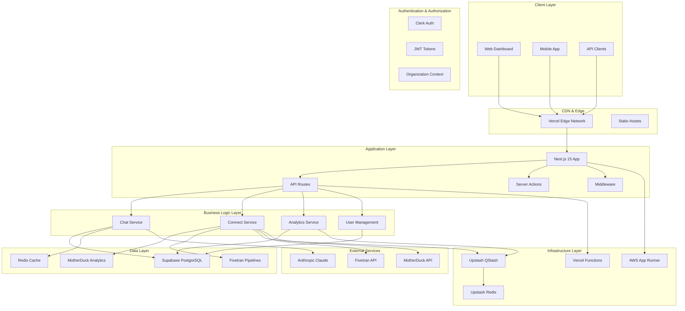
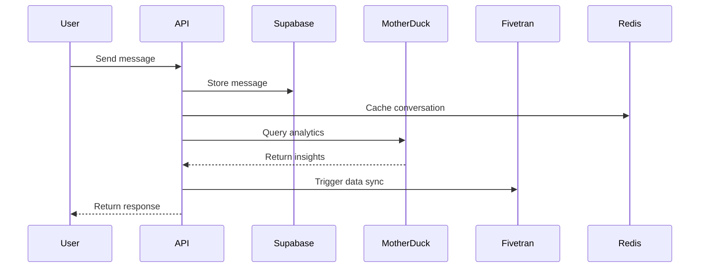
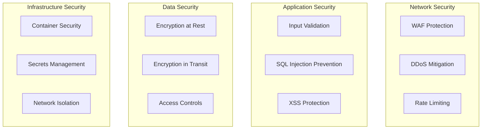
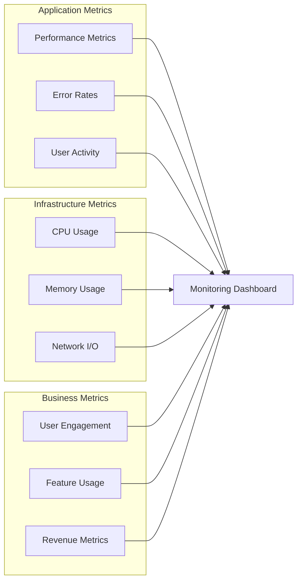
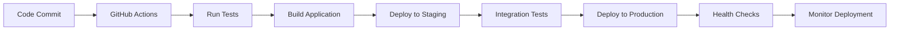
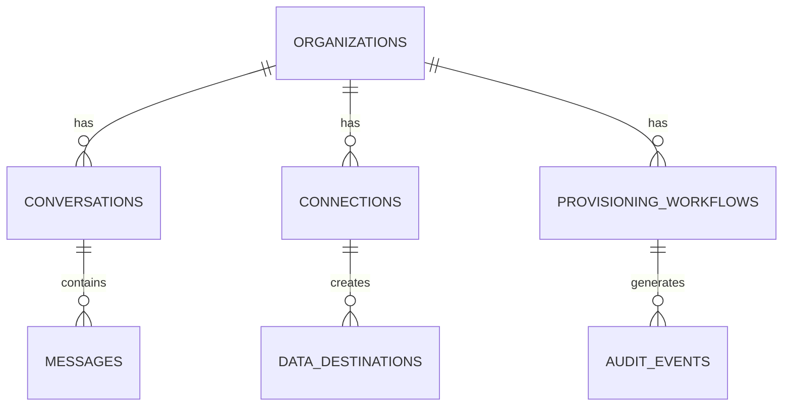
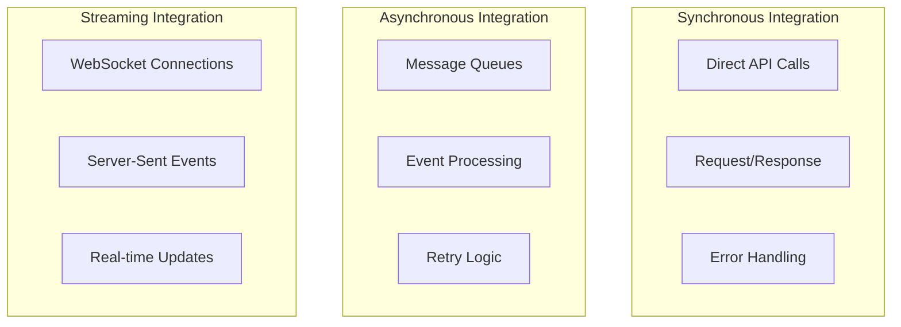

# System Architecture

This document provides a comprehensive overview of the Hubble platform's system architecture, including component interactions, data flow, and design decisions.

## Overview

Hubble is a modern, cloud-native AI-powered marketing assistant platform built with a microservices architecture. The system is designed for scalability, reliability, and maintainability while providing real-time AI capabilities and multi-tenant data management.

## High-Level Architecture



## Component Architecture

### Frontend Layer

#### Next.js 15 Application

- **Framework**: Next.js 15 with App Router
- **Runtime**: React 19 with concurrent features
- **Styling**: Tailwind CSS v4 with custom design system
- **State Management**: TanStack Query for server state
- **Authentication**: Clerk integration with JWT tokens

#### Key Features

- **Server-Side Rendering**: Optimized for SEO and performance
- **Static Generation**: Pre-built pages for better performance
- **Edge Runtime**: Global edge deployment for low latency
- **Progressive Enhancement**: Works without JavaScript

### API Layer

#### REST API Design

- **RESTful Endpoints**: Standard HTTP methods and status codes
- **Versioning**: API versioning with `/api/v1/` prefix
- **Authentication**: JWT-based authentication with Clerk
- **Rate Limiting**: Per-user rate limiting with Redis
- **Error Handling**: Consistent error response format

#### API Categories

- **Chat API**: Conversation and message management
- **Connect API**: Data pipeline provisioning
- **System API**: Health checks and monitoring
- **Webhook API**: External service integrations

### Business Logic Layer

#### Chat Service

```typescript
interface ChatService {
  // Conversation management
  createConversation(data: CreateConversationData): Promise<Conversation>
  getConversations(filters: ConversationFilters): Promise<Conversation[]>
  updateConversation(id: string, data: UpdateConversationData): Promise<Conversation>

  // Message handling
  createMessage(conversationId: string, data: CreateMessageData): Promise<Message>
  getMessages(conversationId: string, pagination: PaginationOptions): Promise<Message[]>

  // AI integration
  sendChatRequest(request: ChatRequest): Promise<ChatResponse>
  generateTitle(conversationId: string): Promise<string>
}
```

#### Agent Runtime & MCP Orchestration

- **ChatAgentRuntime**: Central coordinator that converts UI messages into MCP-aware streaming calls, shares state across web and CLI clients, and normalizes cancellation/error flows.
- **AgentStore/EventBus**: Immutable store propagates `agent/*` events (runs, tool calls, telemetry) to subscribers, enabling optimistic UI updates and structured logging without duplicating persistence logic.
- **MCP Client Abstraction**: `McpClientConnection` registers capabilities, caches tool schemas, and exposes observer hooks so orchestrators can monitor progress tokens, resumption IDs, and tool output validation.
- **Transport Stewardship**: Streamable HTTP transport supports session resumption, progress notifications, and explicit `notifications/cancelled` contracts to keep long-running tool chains responsive.

#### Connect Service

```typescript
interface ConnectService {
  // Provisioning workflow
  startProvisioning(orgId: string, connectors: ConnectorType[]): Promise<ProvisionRun>
  getProvisionStatus(correlationId: string): Promise<ProvisionStatus>
  getProvisionStream(correlationId: string): EventStream

  // Connection management
  createConnection(
    orgId: string,
    type: ConnectorType,
    credentials: Credentials,
  ): Promise<Connection>
  getConnections(orgId: string): Promise<Connection[]>
  updateConnectionStatus(connectionId: string, status: ConnectionStatus): Promise<void>
}
```

### Data Layer

#### Database Architecture

- **Primary Database**: Supabase (PostgreSQL) with RLS
- **Analytics Database**: MotherDuck (DuckDB) per organization
- **Cache Layer**: Upstash Redis for session and data caching
- **Queue System**: Upstash QStash for background job processing

#### Data Flow



## Security Architecture

### Authentication & Authorization

- **Multi-Factor Authentication**: Clerk-based MFA
- **JWT Tokens**: Secure token-based authentication
- **Organization Scoping**: Multi-tenant data isolation
- **Role-Based Access Control**: Granular permission system

### Data Protection

- **Encryption at Rest**: All data encrypted in databases
- **Encryption in Transit**: HTTPS/TLS for all communications
- **Row Level Security**: Database-level access control
- **Audit Logging**: Comprehensive audit trail

### Security Layers



## Scalability Architecture

### Horizontal Scaling

- **Stateless Services**: All services are stateless for easy scaling
- **Load Balancing**: Automatic load balancing across instances
- **Database Sharding**: Organization-based data sharding
- **CDN Distribution**: Global content delivery network

### Performance Optimization

- **Caching Strategy**: Multi-layer caching with Redis
- **Database Indexing**: Optimized indexes for query performance
- **Connection Pooling**: Efficient database connection management
- **Code Splitting**: Lazy loading for reduced bundle size

### Monitoring & Observability



## Deployment Architecture

### Cloud Infrastructure

- **Frontend**: Vercel Edge Network
- **Backend**: Vercel Functions + AWS App Runner
- **Database**: Supabase (PostgreSQL)
- **Cache**: Upstash Redis
- **Queue**: Upstash QStash
- **Analytics**: MotherDuck + Fivetran

### Deployment Pipeline



### Environment Strategy

- **Development**: Local development with hot reloading
- **Staging**: Production-like environment for testing
- **Production**: High-availability production environment
- **Preview**: Branch-based preview deployments

## Data Architecture

### Database Design

- **Core Schema**: Organization and user management
- **Chat Schema**: Conversation and message storage
- **Connect Schema**: Data pipeline configuration
- **System Schema**: Audit logs and system data

### Data Relationships



### Data Flow Patterns

- **Event Sourcing**: Audit events for complete history
- **CQRS**: Command Query Responsibility Segregation
- **Event Streaming**: Real-time data updates via SSE
- **Data Synchronization**: Automated data pipeline updates

## Integration Architecture

### External Service Integration

- **Clerk**: Authentication and user management
- **Anthropic**: AI chat capabilities
- **MotherDuck**: Analytics database
- **Fivetran**: Data pipeline automation
- **Upstash**: Redis and queue services

### API Integration Patterns



## Technology Stack

### Frontend Technologies

- **Next.js 15**: React framework with App Router
- **React 19**: UI library with concurrent features
- **TypeScript**: Type-safe JavaScript
- **Tailwind CSS**: Utility-first CSS framework
- **TanStack Query**: Data fetching and caching

### Backend Technologies

- **Node.js**: JavaScript runtime
- **Supabase**: Backend-as-a-Service
- **PostgreSQL**: Relational database
- **Redis**: In-memory data store
- **QStash**: Message queue system

### Infrastructure Technologies

- **Vercel**: Frontend hosting and edge functions
- **AWS App Runner**: Container hosting
- **Docker**: Containerization
- **GitHub Actions**: CI/CD pipeline

## Design Principles

### SOLID Principles

- **Single Responsibility**: Each component has one clear purpose
- **Open/Closed**: Open for extension, closed for modification
- **Liskov Substitution**: Derived classes must be substitutable
- **Interface Segregation**: Many specific interfaces are better than one general
- **Dependency Inversion**: Depend on abstractions, not concretions

### Clean Architecture

- **Separation of Concerns**: Clear boundaries between layers
- **Dependency Rule**: Dependencies point inward
- **Testability**: Easy to test in isolation
- **Independence**: Framework and UI independent

### Microservices Principles

- **Service Independence**: Services can be deployed independently
- **Data Isolation**: Each service owns its data
- **Communication**: Services communicate via APIs
- **Fault Tolerance**: Services fail independently

## Performance Considerations

### Frontend Performance

- **Code Splitting**: Lazy loading of components
- **Image Optimization**: Next.js Image component
- **Bundle Analysis**: Regular bundle size monitoring
- **Caching Strategy**: Aggressive caching for static assets

### Backend Performance

- **Database Optimization**: Proper indexing and query optimization
- **Connection Pooling**: Efficient database connections
- **Caching**: Redis for frequently accessed data
- **Async Processing**: Background job processing

### Network Performance

- **CDN**: Global content delivery
- **Compression**: Gzip/Brotli compression
- **HTTP/2**: Multiplexed connections
- **Edge Computing**: Processing closer to users

## System Monitoring

### Application Monitoring

- **Performance Metrics**: Response times, throughput
- **Error Tracking**: Error rates and types
- **User Analytics**: User behavior and engagement
- **Business Metrics**: Key performance indicators

### Infrastructure Monitoring

- **Resource Usage**: CPU, memory, disk, network
- **Service Health**: Uptime and availability
- **Dependency Health**: External service status
- **Security Monitoring**: Threat detection and response

### Logging Strategy

- **Structured Logging**: JSON-formatted logs
- **Log Levels**: Debug, info, warn, error
- **Centralized Logging**: Aggregated log collection
- **Log Retention**: Appropriate retention policies

## Disaster Recovery

### Backup Strategy

- **Database Backups**: Regular automated backups
- **Code Backups**: Git repository with multiple remotes
- **Configuration Backups**: Infrastructure as code
- **Data Replication**: Cross-region data replication

### Recovery Procedures

- **RTO (Recovery Time Objective)**: < 1 hour
- **RPO (Recovery Point Objective)**: < 15 minutes
- **Failover Procedures**: Automated failover processes
- **Testing**: Regular disaster recovery testing

## Future Considerations

### Scalability Roadmap

- **Microservices Migration**: Gradual service extraction
- **Multi-Region Deployment**: Global availability
- **Advanced Caching**: Distributed caching strategies
- **Event-Driven Architecture**: Event sourcing implementation

### Technology Evolution

- **Framework Updates**: Regular technology updates
- **Performance Improvements**: Continuous optimization
- **Security Enhancements**: Ongoing security improvements
- **Feature Additions**: New capability development

## Related Documentation

- [API Documentation](./apps/dashboard/api.md)
- [Database Schema](./supabase/overview.md)
- [Package Documentation](./packages/overview.md)
- [Agent Backend Deployment](./deployment/agent-backend.md)
