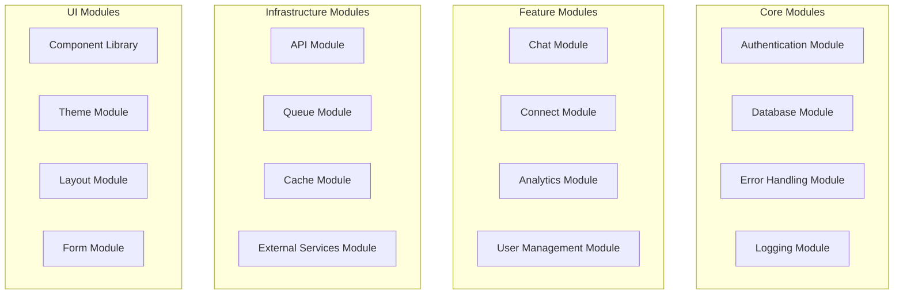
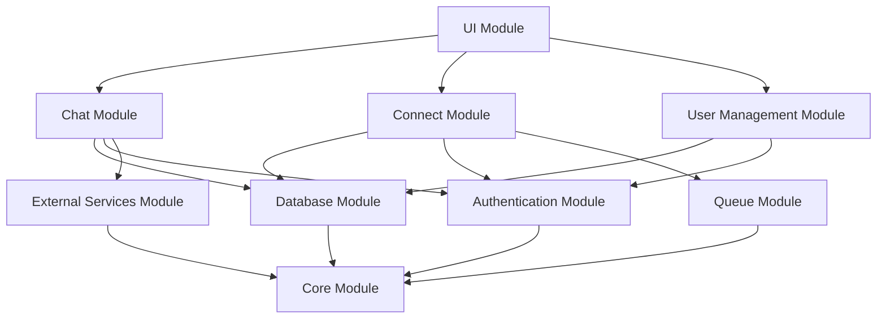

# Modules Documentation

This directory contains detailed documentation for individual modules and components within the Hubble platform.

## Overview

The Hubble platform is organized into distinct modules, each with specific responsibilities and well-defined interfaces. This documentation provides comprehensive information about each module's purpose, implementation, and usage.

## Module Architecture



## Available Modules

### Core Modules

#### Authentication Module

- **Purpose**: User authentication and authorization
- **Location**: `packages/auth/`
- **Documentation**: [Authentication Module](./authentication.md)
- **Key Features**:
    - JWT token management
    - Organization context
    - User session handling
    - Permission management

#### Database Module

- **Purpose**: Database operations and client management
- **Location**: `packages/db/`
- **Documentation**: [Database Module](./database.md)
- **Key Features**:
    - Supabase client factories
    - Row Level Security (RLS)
    - Connection pooling
    - Query optimization

#### Error Handling Module

- **Purpose**: Centralized error handling and management
- **Location**: `packages/core/`
- **Documentation**: [Error Handling Module](./error-handling.md)
- **Key Features**:
    - Custom error classes
    - Error logging
    - Error recovery
    - User-friendly error messages

#### Logging Module

- **Purpose**: Structured logging and monitoring
- **Location**: `packages/logger/`
- **Documentation**: [Logging Module](./logging.md)
- **Key Features**:
    - Structured logging
    - Log levels
    - Performance monitoring
    - Error tracking

### Feature Modules

#### Chat Module

- **Purpose**: AI-powered chat functionality
- **Location**: `packages/chat/`
- **Documentation**: [Chat Module](./chat.md)
- **Key Features**:
    - Conversation management
    - Message handling
    - AI integration
    - Real-time updates

#### Connect Module

- **Purpose**: Data pipeline provisioning and management
- **Location**: `packages/connect/`
- **Documentation**: [Connect Module](./connect.md)
- **Key Features**:
    - Data source connections
    - Provisioning workflows
    - Status monitoring
    - Error handling

#### Analytics Module

- **Purpose**: Data analysis and reporting
- **Location**: `packages/analytics/`
- **Documentation**: [Analytics Module](./analytics.md)
- **Key Features**:
    - Data visualization
    - Report generation
    - Performance metrics
    - Custom dashboards

#### User Management Module

- **Purpose**: User and organization management
- **Location**: `packages/user-management/`
- **Documentation**: [User Management Module](./user-management.md)
- **Key Features**:
    - User profiles
    - Organization management
    - Role-based access control
    - Team collaboration

### Infrastructure Modules

#### API Module

- **Purpose**: REST API implementation and management
- **Location**: `apps/dashboard/src/app/api/`
- **Documentation**: [API Module](./api.md)
- **Key Features**:
    - RESTful endpoints
    - Request validation
    - Response formatting
    - Rate limiting

#### Queue Module

- **Purpose**: Background job processing
- **Location**: `packages/infrastructure/`
- **Documentation**: [Queue Module](./queue.md)
- **Key Features**:
    - Job queuing
    - Background processing
    - Retry logic
    - Dead letter queues

#### Cache Module

- **Purpose**: Caching and session management
- **Location**: `packages/infrastructure/`
- **Documentation**: [Cache Module](./cache.md)
- **Key Features**:
    - Redis integration
    - Session storage
    - Data caching
    - Cache invalidation

#### External Services Module

- **Purpose**: Third-party service integrations
- **Location**: `packages/external-services/`
- **Documentation**: [External Services Module](./external-services.md)
- **Key Features**:
    - API clients
    - Service abstraction
    - Error handling
    - Rate limiting

### UI Modules

#### Component Library

- **Purpose**: Reusable UI components
- **Location**: `packages/ui/`
- **Documentation**: [Component Library](./component-library.md)
- **Key Features**:
    - React components
    - TypeScript support
    - Accessibility
    - Responsive design

#### Theme Module

- **Purpose**: Design system and theming
- **Location**: `packages/ui/src/theme/`
- **Documentation**: [Theme Module](./theme.md)
- **Key Features**:
    - Color system
    - Typography
    - Spacing
    - Dark mode

#### Layout Module

- **Purpose**: Page layouts and navigation
- **Location**: `packages/ui/src/layout/`
- **Documentation**: [Layout Module](./layout.md)
- **Key Features**:
    - Page layouts
    - Navigation
    - Sidebar
    - Header

#### Form Module

- **Purpose**: Form components and validation
- **Location**: `packages/ui/src/forms/`
- **Documentation**: [Form Module](./form.md)
- **Key Features**:
    - Form components
    - Validation
    - Error handling
    - Accessibility

## Module Development

### Creating a New Module

1. **Define Module Purpose**: Clearly define what the module does
2. **Create Module Structure**: Set up the directory structure
3. **Implement Core Functionality**: Build the main features
4. **Add Tests**: Write comprehensive tests
5. **Document Module**: Create detailed documentation
6. **Export Public API**: Define the public interface

### Module Structure Template

```text
packages/module-name/
├── src/
│   ├── index.ts              # Main export file
│   ├── types/                # TypeScript types
│   ├── utils/                # Utility functions
│   ├── services/             # Business logic
│   ├── components/           # React components (if applicable)
│   └── __tests__/            # Test files
├── package.json              # Package configuration
├── tsconfig.json             # TypeScript configuration
├── README.md                 # Module documentation
└── CHANGELOG.md              # Change log
```

### Module Guidelines

#### Naming Conventions

- **Package Name**: `@hubble/module-name`
- **Directory Name**: `module-name` (kebab-case)
- **Export Names**: Use descriptive, clear names
- **File Names**: Use kebab-case for files

#### Dependencies

- **Minimal Dependencies**: Only include necessary dependencies
- **Peer Dependencies**: Use for major frameworks
- **Internal Dependencies**: Use workspace packages when possible
- **Version Management**: Keep dependencies up to date

#### API Design

- **Consistent Interface**: Follow established patterns
- **Type Safety**: Use TypeScript for all APIs
- **Error Handling**: Implement proper error handling
- **Documentation**: Document all public APIs

#### Testing

- **Unit Tests**: Test individual functions and components
- **Integration Tests**: Test module interactions
- **Coverage**: Maintain high test coverage
- **Performance Tests**: Test performance characteristics

## Module Integration

### Inter-Module Communication

#### Direct Imports

```typescript
// Direct import for simple dependencies
import { generateId } from "@hubble/core"
import { createClient } from "@hubble/db"
```

#### Service Injection

```typescript
// Service injection for complex dependencies
interface ChatService {
    createConversation(data: CreateConversationData): Promise<Conversation>
}

class ChatModule {
    constructor(private chatService: ChatService) {}
}
```

#### Event-Driven Communication

```typescript
// Event-driven communication for loose coupling
import { EventBus } from "@hubble/core"

class ChatModule {
    constructor(private eventBus: EventBus) {
        this.eventBus.on("user.created", this.handleUserCreated.bind(this))
    }
}
```

### Module Dependencies

#### Dependency Graph



#### Circular Dependencies

- **Avoid Circular Dependencies**: Design modules to avoid circular imports
- **Use Events**: Use event-driven communication for circular dependencies
- **Extract Common Code**: Move shared code to common modules
- **Dependency Injection**: Use dependency injection to break cycles

## Module Testing

### Testing Strategy

#### Unit Testing

```typescript
// Test individual module functions
import { generateId } from "@hubble/core"

describe("Core Module", () => {
    it("should generate unique IDs", () => {
        const id1 = generateId()
        const id2 = generateId()
        expect(id1).not.toBe(id2)
    })
})
```

#### Integration Testing

```typescript
// Test module interactions
import { ChatModule } from "@hubble/chat"
import { DatabaseModule } from "@hubble/db"

describe("Chat Module Integration", () => {
    it("should create conversation in database", async () => {
        const db = new DatabaseModule()
        const chat = new ChatModule(db)

        const conversation = await chat.createConversation({
            title: "Test Conversation",
        })

        expect(conversation.id).toBeDefined()
    })
})
```

#### Mocking Dependencies

```typescript
// Mock external dependencies
import { vi } from "vitest"

const mockDatabase = {
    createConversation: vi.fn(),
    getConversations: vi.fn(),
}

const chatModule = new ChatModule(mockDatabase)
```

## Module Documentation

### Documentation Standards

#### README Structure

1. **Overview**: What the module does
2. **Installation**: How to install and use
3. **API Reference**: Complete API documentation
4. **Examples**: Usage examples
5. **Configuration**: Configuration options
6. **Testing**: How to test the module
7. **Contributing**: How to contribute

#### Code Documentation

````typescript
/**
 * Creates a new conversation in the database
 * @param data - Conversation creation data
 * @param data.title - Conversation title
 * @param data.model - AI model to use
 * @param data.systemPrompt - Optional system prompt
 * @returns Promise resolving to created conversation
 * @throws {ValidationError} When input data is invalid
 * @throws {DatabaseError} When database operation fails
 * @example
 * ```typescript
 * const conversation = await createConversation({
 *   title: 'Marketing Strategy',
 *   model: 'claude-3-sonnet'
 * })
 * ```
 */
export async function createConversation(data: CreateConversationData): Promise<Conversation> {
    // Implementation
}
````

## Module Maintenance

### Version Management

#### Semantic Versioning

- **Major**: Breaking changes
- **Minor**: New features (backward compatible)
- **Patch**: Bug fixes (backward compatible)

#### Changelog

```markdown
# Changelog

## [1.2.0] - 2024-01-15

### Added

- New conversation export feature
- Support for custom AI models

### Changed

- Updated conversation API response format
- Improved error handling

### Fixed

- Fixed conversation title generation bug
- Resolved memory leak in message handling

## [1.1.0] - 2024-01-01

### Added

- Initial release
- Basic conversation management
- Message handling
```

### Deprecation Management

#### Deprecation Process

1. **Mark as Deprecated**: Add deprecation warnings
2. **Document Migration**: Provide migration guides
3. **Maintain Compatibility**: Keep deprecated features working
4. **Remove in Next Major**: Remove in next major version

#### Deprecation Example

```typescript
/**
 * @deprecated Use createConversation instead
 * @see createConversation
 */
export function createChat(data: ChatData): Promise<Chat> {
    console.warn("createChat is deprecated, use createConversation instead")
    return createConversation(data)
}
```

## Related Documentation

- [Architecture Guide](../architecture.md)
- [Setup Guide](../setup.md)
- [API Documentation](../api/README.md)
- [Package Documentation](../packages/README.md)
- [Testing Documentation](../tests/README.md)
