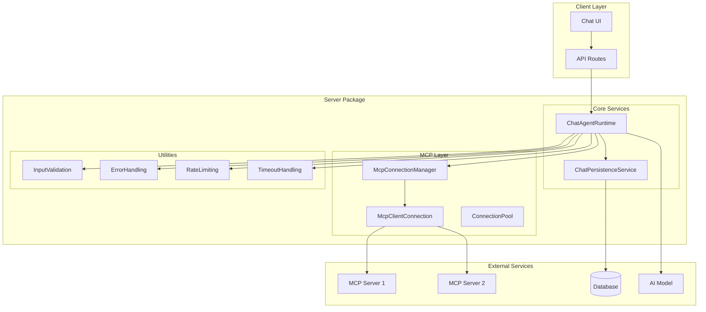
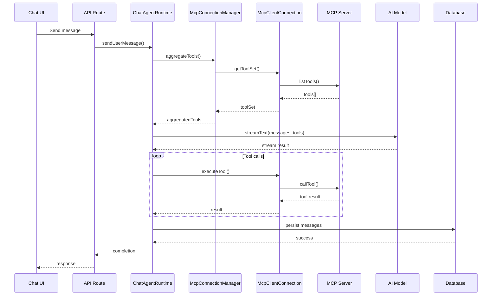
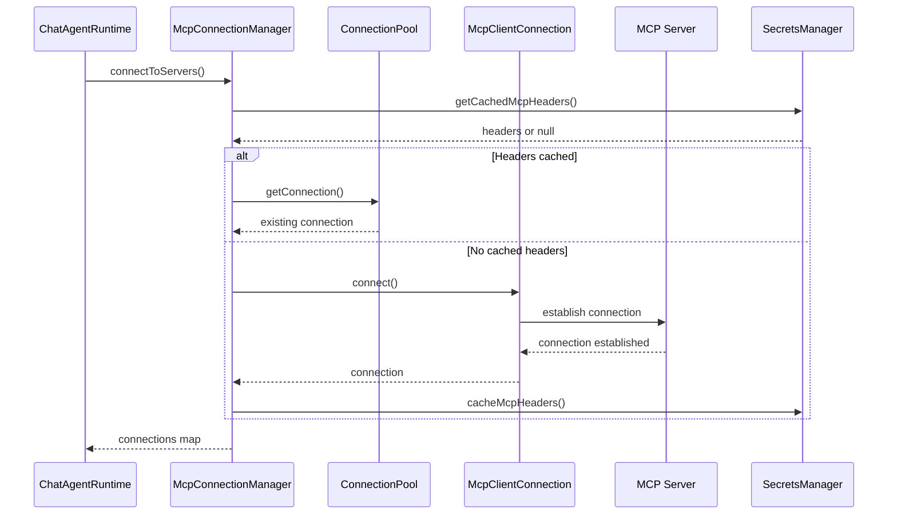
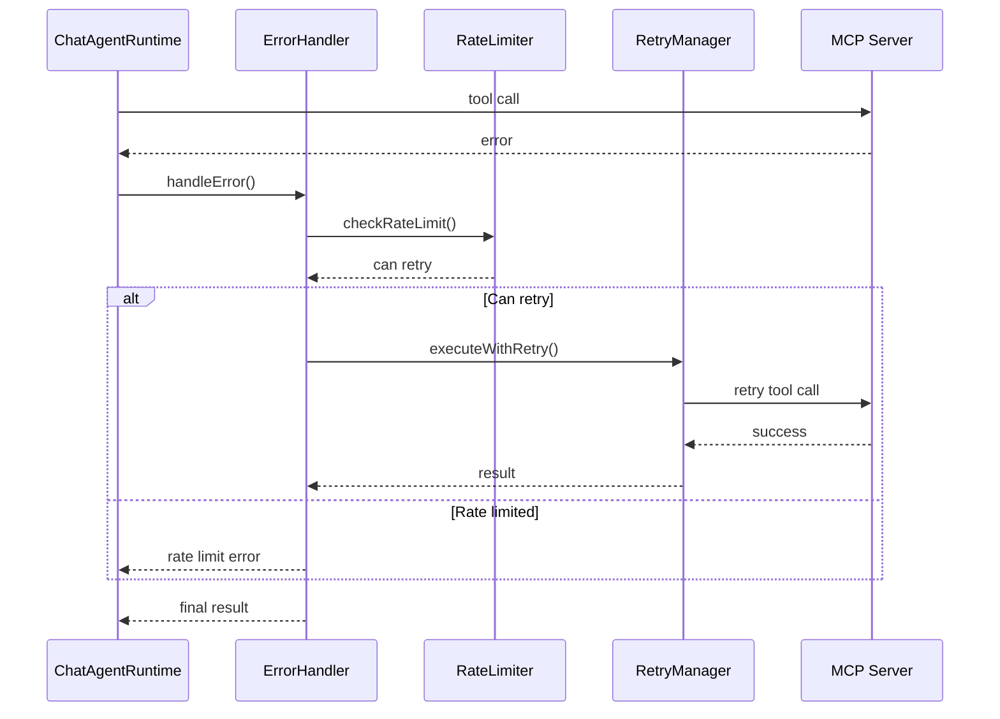

# Server Architecture

This document describes the architecture of the Hubble server package, including the main components, their interactions, and sequence diagrams for key workflows.

## Overview

The server package provides a comprehensive set of utilities for building AI-powered applications with MCP (Model Context Protocol) integration. It includes:

- **Chat Agent Runtime**: Orchestrates AI model interactions and tool calls
- **MCP Client**: Manages connections to MCP servers
- **Connection Manager**: Handles multiple MCP server connections
- **Persistence Service**: Manages chat data storage
- **Utility Services**: Input validation, error handling, rate limiting, etc.

## Core Components

### 1. ChatAgentRuntime

The `ChatAgentRuntime` is the central orchestrator that manages AI model interactions and tool calls via MCP. It handles:

- Connection management for MCP servers
- Tool aggregation and execution
- Message streaming and completion tracking
- Error handling and recovery
- Multi-server support with capability negotiation

### 2. MCP Client

The `McpClientConnection` provides a high-level wrapper around the official MCP TypeScript SDK. It handles:

- Transport setup and connection management
- Capability registration and session management
- Tool wrapping for the AI SDK
- Error handling and retry logic

### 3. Connection Manager

The `McpConnectionManager` manages multiple MCP server connections with:

- Connection pooling and reuse
- Tool aggregation from multiple servers
- Graceful degradation and fallback
- Lifecycle management

### 4. Persistence Service

The `ChatPersistenceService` centralizes all chat-related database operations with:

- Conversation and message management
- Proper error handling and validation
- Transaction support
- Optimized logging for hot paths

## Architecture Diagrams

### System Overview

### Chat Flow Sequence

### MCP Connection Management

### Error Handling and Recovery

## Key Features

### 1. Connection Pooling

The connection pool manages MCP connections efficiently:

- Reuses existing connections when possible
- Manages connection lifecycle
- Handles connection health monitoring
- Provides graceful degradation

### 2. Tool Aggregation

Tools from multiple MCP servers are aggregated with:

- Namespacing to avoid conflicts
- Capability negotiation
- Fallback strategies
- Rate limiting per conversation

### 3. Error Handling

Comprehensive error handling includes:

- Structured error logging
- User-friendly error messages
- Retry logic with exponential backoff
- Circuit breakers for failing services

### 4. Input Validation

Robust input validation provides:

- Message length limits
- Content filtering
- SQL query sanitization
- Tool argument validation

### 5. Security

Security features include:

- CORS and security headers
- Secrets caching and encryption
- Rate limiting and abuse prevention
- Input sanitization

## Configuration

The server package supports extensive configuration through:

- Environment variables
- Configuration files
- Runtime options
- Per-connection settings

## Monitoring and Observability

Built-in monitoring includes:

- Structured logging
- Telemetry collection
- Performance metrics
- Error tracking
- Health checks

## Performance Optimizations

Key performance features:

- Connection pooling
- Optimized logging with sampling
- Request caching and deduplication
- Lazy loading of tools
- Efficient error handling

## Future Enhancements

Planned improvements include:

- Enhanced monitoring and metrics
- Advanced caching strategies
- Improved error recovery
- Better resource management
- Enhanced security features
