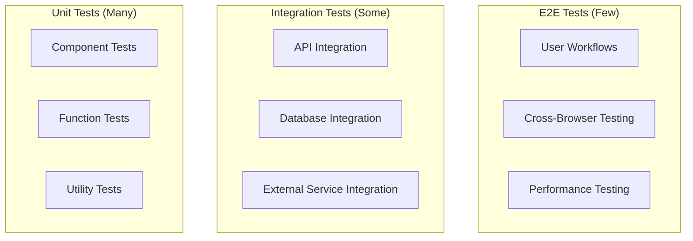

# Testing Documentation

This document provides comprehensive information about testing procedures, test cases, and testing best practices for the Hubble platform.

## Overview

The Hubble platform uses a comprehensive testing strategy that includes unit tests, integration tests, end-to-end tests, and performance tests. This ensures code quality, reliability, and maintainability across all components.

## Testing Strategy

### Testing Pyramid



### Test Types

#### Unit Tests

- **Purpose**: Test individual functions and components in isolation
- **Framework**: Vitest + Testing Library
- **Coverage Target**: 80%+ code coverage
- **Speed**: Fast execution (< 100ms per test)

#### Integration Tests

- **Purpose**: Test component interactions and API endpoints
- **Framework**: Vitest + Supertest
- **Coverage Target**: Critical paths covered
- **Speed**: Medium execution (< 1s per test)

#### End-to-End Tests

- **Purpose**: Test complete user workflows
- **Framework**: Playwright
- **Coverage Target**: Main user journeys
- **Speed**: Slow execution (< 30s per test)

#### Performance Tests

- **Purpose**: Test system performance and load handling
- **Framework**: Artillery + Custom scripts
- **Coverage Target**: Critical performance metrics
- **Speed**: Variable execution time

## Test Configuration

### Vitest Configuration

```typescript
// vitest.config.ts
import { defineConfig } from "vitest/config"
import { resolve } from "path"

export default defineConfig({
    test: {
        environment: "jsdom",
        setupFiles: ["./src/test/setup.ts"],
        coverage: {
            provider: "v8",
            reporter: ["text", "json", "html"],
            exclude: ["node_modules/", "dist/", "**/*.d.ts", "**/*.config.*", "**/test/**"],
            thresholds: {
                global: {
                    branches: 80,
                    functions: 80,
                    lines: 80,
                    statements: 80,
                },
            },
        },
        globals: true,
        testTimeout: 10000,
    },
    resolve: {
        alias: {
            "@": resolve(__dirname, "./src"),
        },
    },
})
```

### Test Setup

```typescript
// src/test/setup.ts
import { beforeAll, afterAll, afterEach } from "vitest"
import { cleanup } from "@testing-library/react"
import { server } from "./mocks/server"

// Start MSW server
beforeAll(() => server.listen())

// Reset handlers after each test
afterEach(() => {
    server.resetHandlers()
    cleanup()
})

// Clean up after all tests
afterAll(() => server.close())
```

### Mock Configuration

```typescript
// src/test/mocks/handlers.ts
import { rest } from "msw"

export const handlers = [
    // API handlers
    rest.get("/api/v1/chat/conversations", (req, res, ctx) => {
        return res(
            ctx.json({
                success: true,
                data: {
                    conversations: [
                        {
                            id: "conv_123",
                            title: "Test Conversation",
                            status: "active",
                            created_at: "2024-01-01T00:00:00Z",
                        },
                    ],
                },
            }),
        )
    }),

    // Database handlers
    rest.post("/api/v1/chat/conversations", (req, res, ctx) => {
        return res(
            ctx.json({
                success: true,
                data: {
                    id: "conv_456",
                    title: "New Conversation",
                    status: "active",
                    created_at: "2024-01-01T00:00:00Z",
                },
            }),
        )
    }),
]
```

## Unit Testing

### Component Testing

#### React Component Tests

```typescript
// src/components/Button.test.tsx
import { render, screen, fireEvent } from '@testing-library/react'
import { Button } from './Button'

describe('Button', () => {
  it('renders with correct text', () => {
  render(<Button>Click me</Button>)
  expect(screen.getByRole('button', { name: 'Click me' })).toBeInTheDocument()
  })

  it('handles click events', () => {
  const handleClick = vi.fn()
  render(<Button onClick={handleClick}>Click me</Button>)

  fireEvent.click(screen.getByRole('button'))
  expect(handleClick).toHaveBeenCalledTimes(1)
  })

  it('applies correct variant styles', () => {
  render(<Button variant="primary">Primary Button</Button>)
  expect(screen.getByRole('button')).toHaveClass('bg-blue-500')
  })

  it('disables button when disabled prop is true', () => {
  render(<Button disabled>Disabled Button</Button>)
  expect(screen.getByRole('button')).toBeDisabled()
  })
})
```

#### Hook Testing

```typescript
// src/hooks/useChat.test.ts
import { renderHook, act } from "@testing-library/react"
import { useChat } from "./useChat"

describe("useChat", () => {
    it("initializes with empty conversations", () => {
        const { result } = renderHook(() => useChat())

        expect(result.current.conversations).toEqual([])
        expect(result.current.loading).toBe(false)
    })

    it("loads conversations on mount", async () => {
        const { result } = renderHook(() => useChat())

        await act(async () => {
            await result.current.loadConversations()
        })

        expect(result.current.conversations).toHaveLength(1)
        expect(result.current.loading).toBe(false)
    })

    it("creates new conversation", async () => {
        const { result } = renderHook(() => useChat())

        await act(async () => {
            await result.current.createConversation("Test Conversation")
        })

        expect(result.current.conversations).toHaveLength(1)
        expect(result.current.conversations[0].title).toBe("Test Conversation")
    })
})
```

### Function Testing

#### Utility Function Tests

```typescript
// src/utils/generateId.test.ts
import { generateId } from "./generateId"

describe("generateId", () => {
    it("generates unique IDs", () => {
        const id1 = generateId()
        const id2 = generateId()

        expect(id1).not.toBe(id2)
        expect(id1).toMatch(/^id_/)
    })

    it("includes prefix when provided", () => {
        const id = generateId("user")

        expect(id).toMatch(/^user_/)
    })

    it("generates different IDs with same prefix", () => {
        const id1 = generateId("user")
        const id2 = generateId("user")

        expect(id1).not.toBe(id2)
    })
})
```

#### API Function Tests

```typescript
// src/api/chat.test.ts
import { createConversation, getConversations } from "./chat"
import { server } from "../test/mocks/server"

describe("Chat API", () => {
    it("fetches conversations", async () => {
        const conversations = await getConversations()

        expect(conversations).toHaveLength(1)
        expect(conversations[0]).toMatchObject({
            id: "conv_123",
            title: "Test Conversation",
            status: "active",
        })
    })

    it("creates new conversation", async () => {
        const conversation = await createConversation({
            title: "New Conversation",
            model: "claude-3-sonnet",
        })

        expect(conversation).toMatchObject({
            id: "conv_456",
            title: "New Conversation",
            status: "active",
        })
    })

    it("handles API errors", async () => {
        server.use(
            rest.get("/api/v1/chat/conversations", (req, res, ctx) => {
                return res(ctx.status(500), ctx.json({ error: "Server Error" }))
            }),
        )

        await expect(getConversations()).rejects.toThrow("Server Error")
    })
})
```

## Integration Testing

### API Integration Tests

#### Endpoint Testing

```typescript
// tests/api/chat.test.ts
import request from "supertest"
import { app } from "../src/app"

describe("Chat API Endpoints", () => {
    describe("GET /api/v1/chat/conversations", () => {
        it("returns conversations for authenticated user", async () => {
            const response = await request(app)
                .get("/api/v1/chat/conversations")
                .set("Authorization", "Bearer valid-token")
                .expect(200)

            expect(response.body.success).toBe(true)
            expect(response.body.data.conversations).toBeDefined()
        })

        it("returns 401 for unauthenticated request", async () => {
            await request(app).get("/api/v1/chat/conversations").expect(401)
        })

        it("supports pagination", async () => {
            const response = await request(app)
                .get("/api/v1/chat/conversations?limit=10&offset=0")
                .set("Authorization", "Bearer valid-token")
                .expect(200)

            expect(response.body.data.pagination).toMatchObject({
                limit: 10,
                offset: 0,
            })
        })
    })

    describe("POST /api/v1/chat/conversations", () => {
        it("creates new conversation", async () => {
            const conversationData = {
                title: "Test Conversation",
                model: "claude-3-sonnet",
            }

            const response = await request(app)
                .post("/api/v1/chat/conversations")
                .set("Authorization", "Bearer valid-token")
                .send(conversationData)
                .expect(201)

            expect(response.body.success).toBe(true)
            expect(response.body.data.title).toBe("Test Conversation")
        })

        it("validates required fields", async () => {
            const response = await request(app)
                .post("/api/v1/chat/conversations")
                .set("Authorization", "Bearer valid-token")
                .send({})
                .expect(400)

            expect(response.body.success).toBe(false)
            expect(response.body.error.code).toBe("VALIDATION_ERROR")
        })
    })
})
```

#### Database Integration Tests

```typescript
// tests/integration/database.test.ts
import { createBrowserClient } from "@hubble/db"
import { createConversation, getConversations } from "../src/api/chat"

describe("Database Integration", () => {
    let supabase: any

    beforeAll(async () => {
        supabase = createBrowserClient({ authToken: "test-token" })
    })

    it("creates and retrieves conversations", async () => {
        // Create conversation
        const conversation = await createConversation({
            title: "Test Conversation",
            model: "claude-3-sonnet",
        })

        expect(conversation.id).toBeDefined()
        expect(conversation.title).toBe("Test Conversation")

        // Retrieve conversations
        const conversations = await getConversations()
        expect(conversations).toContainEqual(
            expect.objectContaining({
                id: conversation.id,
                title: "Test Conversation",
            }),
        )
    })

    it("handles database errors gracefully", async () => {
        // Mock database error
        vi.spyOn(supabase.from, "select").mockRejectedValue(new Error("Database Error"))

        await expect(getConversations()).rejects.toThrow("Database Error")
    })
})
```

### External Service Integration Tests

#### Third-Party API Tests

```typescript
// tests/integration/external.test.ts
import { AnthropicClient } from "../src/clients/anthropic"

describe("External Service Integration", () => {
    describe("Anthropic API", () => {
        it("sends chat request to Anthropic", async () => {
            const client = new AnthropicClient("test-api-key")

            const response = await client.sendMessage({
                message: "Hello, world!",
                model: "claude-3-sonnet",
            })

            expect(response.content).toBeDefined()
            expect(response.model).toBe("claude-3-sonnet")
        })

        it("handles API errors", async () => {
            const client = new AnthropicClient("invalid-key")

            await expect(
                client.sendMessage({
                    message: "Hello, world!",
                    model: "claude-3-sonnet",
                }),
            ).rejects.toThrow("Authentication Error")
        })
    })
})
```

## End-to-End Testing

### Playwright Configuration

```typescript
// playwright.config.ts
import { defineConfig } from "@playwright/test"

export default defineConfig({
    testDir: "./tests/e2e",
    fullyParallel: true,
    forbidOnly: !!process.env.CI,
    retries: process.env.CI ? 2 : 0,
    workers: process.env.CI ? 1 : undefined,
    reporter: "html",
    use: {
        baseURL: "http://localhost:3000",
        trace: "on-first-retry",
        screenshot: "only-on-failure",
    },
    projects: [
        {
            name: "chromium",
            use: { ...devices["Desktop Chrome"] },
        },
        {
            name: "firefox",
            use: { ...devices["Desktop Firefox"] },
        },
        {
            name: "webkit",
            use: { ...devices["Desktop Safari"] },
        },
    ],
    webServer: {
        command: "pnpm dev",
        url: "http://localhost:3000",
        reuseExistingServer: !process.env.CI,
    },
})
```

### E2E Test Examples

#### User Authentication Flow

```typescript
// tests/e2e/auth.spec.ts
import { test, expect } from "@playwright/test"

test.describe("Authentication", () => {
    test("user can sign in", async ({ page }) => {
        await page.goto("/sign-in")

        await page.fill('[data-testid="email-input"]', "test@example.com")
        await page.fill('[data-testid="password-input"]', "password123")
        await page.click('[data-testid="sign-in-button"]')

        await expect(page).toHaveURL("/dashboard")
        await expect(page.locator('[data-testid="user-menu"]')).toBeVisible()
    })

    test("user can sign out", async ({ page }) => {
        // Sign in first
        await page.goto("/sign-in")
        await page.fill('[data-testid="email-input"]', "test@example.com")
        await page.fill('[data-testid="password-input"]', "password123")
        await page.click('[data-testid="sign-in-button"]')

        // Sign out
        await page.click('[data-testid="user-menu"]')
        await page.click('[data-testid="sign-out-button"]')

        await expect(page).toHaveURL("/sign-in")
    })
})
```

#### Chat Functionality

```typescript
// tests/e2e/chat.spec.ts
import { test, expect } from "@playwright/test"

test.describe("Chat Functionality", () => {
    test("user can create and send messages", async ({ page }) => {
        await page.goto("/chat")

        // Create new conversation
        await page.click('[data-testid="new-conversation-button"]')
        await page.fill('[data-testid="conversation-title-input"]', "Test Conversation")
        await page.click('[data-testid="create-conversation-button"]')

        // Send message
        await page.fill('[data-testid="message-input"]', "Hello, AI!")
        await page.click('[data-testid="send-message-button"]')

        // Verify message appears
        await expect(page.locator('[data-testid="message-list"]')).toContainText("Hello, AI!")

        // Wait for AI response
        await expect(page.locator('[data-testid="ai-message"]')).toBeVisible({ timeout: 10000 })
    })

    test("user can view conversation history", async ({ page }) => {
        await page.goto("/chat")

        // Check if conversations are loaded
        await expect(page.locator('[data-testid="conversation-list"]')).toBeVisible()

        // Click on existing conversation
        await page.click('[data-testid="conversation-item"]:first-child')

        // Verify messages are loaded
        await expect(page.locator('[data-testid="message-list"]')).toBeVisible()
    })
})
```

#### Connect Feature

```typescript
// tests/e2e/connect.spec.ts
import { test, expect } from "@playwright/test"

test.describe("Connect Feature", () => {
    test("user can start provisioning", async ({ page }) => {
        await page.goto("/connect")

        // Start provisioning
        await page.click('[data-testid="enable-connect-button"]')

        // Select connectors
        await page.check('[data-testid="facebook-ads-checkbox"]')
        await page.check('[data-testid="google-ads-checkbox"]')
        await page.click('[data-testid="start-provisioning-button"]')

        // Verify provisioning started
        await expect(page.locator('[data-testid="provisioning-status"]')).toContainText("Running")

        // Wait for completion
        await expect(page.locator('[data-testid="provisioning-status"]')).toContainText("Ready", {
            timeout: 30000,
        })
    })

    test("user can view connection status", async ({ page }) => {
        await page.goto("/connect")

        // Check connection overview
        await expect(page.locator('[data-testid="connection-overview"]')).toBeVisible()

        // Verify data destination status
        await expect(page.locator('[data-testid="destination-status"]')).toContainText("Healthy")
    })
})
```

## Performance Testing

### Load Testing

#### Artillery Configuration

```yaml
# artillery-config.yml
config:
  target: "http://localhost:3000"
  phases:
  - duration: 60
    arrivalRate: 10
  - duration: 120
    arrivalRate: 20
  - duration: 60
    arrivalRate: 10
  defaults:
  headers:
    Authorization: "Bearer test-token"

scenarios:
  - name: "Chat API Load Test"
  weight: 50
  flow:
    - get:
        url: "/api/v1/chat/conversations"
    - post:
        url: "/api/v1/chat"
        json:
          conversation_id: "{{ $randomString() }}"
          message: "Test message"
          model: "claude-3-sonnet"

  - name: "Connect API Load Test"
  weight: 30
  flow:
    - get:
        url: "/api/connect/overview"
    - post:
        url: "/api/connect/enable"
        json:
          connector_types: ["facebook_ads"]

  - name: "Health Check Load Test"
  weight: 20
  flow:
    - get:
        url: "/healthz"
```

#### Performance Test Script

```typescript
// tests/performance/load-test.ts
import { test, expect } from "@playwright/test"

test.describe("Performance Tests", () => {
    test("API response times are acceptable", async ({ request }) => {
        const startTime = Date.now()

        const response = await request.get("/api/v1/chat/conversations")

        const responseTime = Date.now() - startTime

        expect(response.status()).toBe(200)
        expect(responseTime).toBeLessThan(1000) // 1 second
    })

    test("concurrent requests are handled properly", async ({ request }) => {
        const promises = Array.from({ length: 10 }, () => request.get("/api/v1/chat/conversations"))

        const responses = await Promise.all(promises)

        responses.forEach((response) => {
            expect(response.status()).toBe(200)
        })
    })
})
```

### Memory and Resource Testing

```typescript
// tests/performance/memory.test.ts
import { test, expect } from "@playwright/test"

test.describe("Memory Tests", () => {
    test("application does not have memory leaks", async ({ page }) => {
        await page.goto("/chat")

        // Perform multiple operations
        for (let i = 0; i < 10; i++) {
            await page.click('[data-testid="new-conversation-button"]')
            await page.fill('[data-testid="conversation-title-input"]', `Conversation ${i}`)
            await page.click('[data-testid="create-conversation-button"]')
            await page.fill('[data-testid="message-input"]', `Message ${i}`)
            await page.click('[data-testid="send-message-button"]')
        }

        // Check memory usage
        const memoryUsage = await page.evaluate(() => {
            return (performance as any).memory?.usedJSHeapSize || 0
        })

        expect(memoryUsage).toBeLessThan(50 * 1024 * 1024) // 50MB
    })
})
```

## Test Data Management

### Test Fixtures

```typescript
// tests/fixtures/conversations.ts
export const conversationFixtures = {
    validConversation: {
        title: "Test Conversation",
        model: "claude-3-sonnet",
        system_prompt: "You are a helpful assistant.",
    },

    invalidConversation: {
        title: "",
        model: "invalid-model",
    },

    conversations: [
        {
            id: "conv_1",
            title: "Marketing Strategy",
            status: "active",
            created_at: "2024-01-01T00:00:00Z",
        },
        {
            id: "conv_2",
            title: "Data Analysis",
            status: "archived",
            created_at: "2024-01-02T00:00:00Z",
        },
    ],
}
```

### Database Seeding

```typescript
// tests/helpers/seed.ts
import { createServiceClient } from "@hubble/db"

export async function seedTestData() {
    const supabase = createServiceClient()

    // Seed organizations
    await supabase.from("core.organizations").insert([
        {
            org_id: "test_org_1",
            slug: "test-org-1",
            status: "ready",
        },
    ])

    // Seed conversations
    await supabase.from("public.conversations").insert([
        {
            id: "conv_1",
            org_id: "test_org_1",
            owner_user_id: "user_1",
            title: "Test Conversation",
            status: "active",
        },
    ])
}

export async function cleanupTestData() {
    const supabase = createServiceClient()

    // Clean up test data
    await supabase.from("public.conversations").delete().eq("org_id", "test_org_1")
    await supabase.from("core.organizations").delete().eq("org_id", "test_org_1")
}
```

## Continuous Integration

### GitHub Actions Workflow

```yaml
# .github/workflows/test.yml
name: Tests

on:
  push:
  branches: [main, develop]
  pull_request:
  branches: [main]

jobs:
  unit-tests:
  runs-on: ubuntu-latest
  steps:
    - uses: actions/checkout@v4
    - uses: actions/setup-node@v4
      with:
        node-version: "20"
        cache: "pnpm"

    - run: pnpm install
    - run: pnpm test:unit
    - run: pnpm test:coverage

    - uses: codecov/codecov-action@v3
      with:
        file: ./coverage/lcov.info

  integration-tests:
  runs-on: ubuntu-latest
  services:
    postgres:
      image: postgres:15
      env:
        POSTGRES_PASSWORD: postgres
      options: >-
        --health-cmd pg_isready
        --health-interval 10s
        --health-timeout 5s
        --health-retries 5

  steps:
    - uses: actions/checkout@v4
    - uses: actions/setup-node@v4
      with:
        node-version: "20"
        cache: "pnpm"

    - run: pnpm install
    - run: pnpm test:integration

  e2e-tests:
  runs-on: ubuntu-latest
  steps:
    - uses: actions/checkout@v4
    - uses: actions/setup-node@v4
      with:
        node-version: "20"
        cache: "pnpm"

    - run: pnpm install
    - run: pnpm build
    - run: pnpm test:e2e

    - uses: actions/upload-artifact@v3
      if: failure()
      with:
        name: playwright-report
        path: playwright-report/
```

## Testing Best Practices

### Test Organization

1. **Group Related Tests**: Use `describe` blocks to group related tests
2. **Descriptive Test Names**: Use clear, descriptive test names
3. **Arrange-Act-Assert**: Structure tests with clear sections
4. **One Assertion Per Test**: Focus on one behavior per test

### Test Data

1. **Use Fixtures**: Create reusable test data fixtures
2. **Clean Up**: Always clean up test data after tests
3. **Isolate Tests**: Ensure tests don't depend on each other
4. **Mock External Dependencies**: Mock external services and APIs

### Performance

1. **Fast Unit Tests**: Keep unit tests fast (< 100ms)
2. **Parallel Execution**: Run tests in parallel when possible
3. **Selective Testing**: Run only relevant tests during development
4. **Test Caching**: Use test result caching for faster runs

### Maintenance

1. **Regular Updates**: Keep tests updated with code changes
2. **Remove Obsolete Tests**: Remove tests for removed features
3. **Refactor Tests**: Refactor tests to improve readability
4. **Monitor Test Performance**: Track test execution times

## Related Documentation

- [Setup Guide](../setup.md)
- [Architecture Guide](../architecture.md)
- [API Documentation](../api/README.md)
- [Package Documentation](../packages/README.md)
